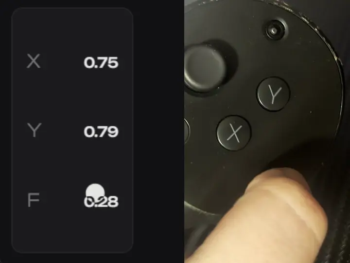

# Quest Pro Touch Plus (qptp)

A Windows app for viewing the additional touch sensors on Quest Pro Touch Pro controllers. It shows the connection state, each controller's status, and live touchpad values (X, Y, and force). The [qptp SteamVR auxiliary driver](openvr-aux/README.md) receives the same live input from this app and exposes it as one additional device alongside the stock Quest Pro controllers.



## Requirements

- Windows 10/11 with WebView2.
- A Quest Pro with [qptp-module](https://github.com/Lateir/qptp-module) installed and running. The module provides the QPV1/QPR3/QPS1 stream.
- USB: ADB debugging authorized on the Quest. ADB and its DLLs are bundled with the app.
- LAN: the computer and Quest on the same local network, with access to UDP port 27183 and TCP port 27182. The app discovers the Quest automatically by UDP broadcast and parallel direct UDP probes.

## Run for development

Run `dev.bat` by double-clicking it or from a terminal. It installs dependencies with `npm ci` if needed.

```powershell
.\dev.bat
```

## Build for Windows

Run `build-installer.bat` to build the Windows NSIS installer. It compiles and bundles the qptp OpenVR driver. During installation, the installer registers the driver with SteamVR; during uninstallation, it removes that registration. SteamVR must be installed for registration, and needs a restart to load or unload the driver reliably.

```powershell
.\build-installer.bat
```

The installer is written to `src-tauri/target/release/bundle/nsis`. For a quick build without an installer, run `npm.cmd run tauri -- build --no-bundle`. In PowerShell, use `npm.cmd`: execution policy may block `npm.ps1` when calling `npm`.

Pushing a tag that matches the version in `package.json` (for example, `v1.0.0`) runs the Windows installer workflow. It builds the SteamVR driver and NSIS installer on a Windows runner, uploads the installer as a workflow artifact, and attaches it to a GitHub release. Keep `package.json`, `package-lock.json`, `src-tauri/Cargo.toml`, and `src-tauri/Cargo.lock` at the same version before tagging.

Close SteamVR before installing, updating, or uninstalling QPTP. SteamVR keeps the driver DLL open while it runs; the installer now checks this before touching the existing installation and offers Retry after SteamVR closes. Silent installs exit without changing the installation while SteamVR is running.

## Behavior

The app connects automatically on startup and retries if the Quest is unavailable or the stream disconnects. LAN is selected on the first launch. Choose USB or LAN on the **Settings** tab; the choice is saved. USB uses the bundled ADB and creates a `tcp:27182` port forward. LAN sends the `QPD1` discovery packet to UDP port 27183 using broadcast every 700 ms and parallel direct probes in batches of 32 per 25 ms on active IPv4 subnets. Subnets larger than /24 are limited to the local /24 for direct probes. Each search lasts up to 3 seconds and repeats after a short pause until the headset responds, including when it is powered on later. The app then connects to the discovered address. TCP reads have a five-second deadline, and haptic writes have a two-second timeout. Stalled sessions are closed, controller values/buttons are cleared, and automatic discovery resumes. `QPV1` supplies the installed module version, `QPS1` supplies controller status, and `QPR3` updates X, Y, force, stylus, trigger proximity, and trigger slide for both controllers. Y = 0 is the top of the touchpad. The minimum supported module `versionCode` is 9 (v3.3), required for QPR3. A lower code or a legacy `QPR2` stream shows a required update card; the app retries so it can reconnect after the module is updated.

While the window is open, the app checks the latest published GitHub Releases for `Lateir/qptp` and `Lateir/qptp-module` on launch and once per hour. When a newer release is available, a separate green arrow beside the tab menu opens an updates view with links to the relevant release pages. A failed or offline check leaves the current status unchanged. The minimum compatible module version is a separate application constant; a release announcement alone does not make an update mandatory.

Minimizing destroys the window to release WebView2 memory while the app continues running in the system tray. Left-click the tray icon to reopen the window. Right-click to see both controllers on one row with their battery percentages (check mark = connected, empty circle = disconnected), followed by **Quit**. Closing the window with its X button exits the app.

On the **Mode** tab, choose one mode for both controllers: **Touchpad**, **Button**, or **2 buttons**. In two-button mode, the upper and lower halves of each touchpad act as separate virtual buttons; the selected half stays active until release. A dual-handle slider sets both the press and release force in the full 0.00–1.00 range, with release no higher than press. The defaults are 0.30 and 0.20. In SteamVR, single-button mode and two-button mode expose separate binding paths for each hand.

The **Status** tab shows SteamVR as connected only after the qptp driver acknowledges the app's input packets. The **Settings** tab has a **Start and close with SteamVR** switch (enabled by default). When enabled, SteamVR loads the installed driver at startup, the driver starts the installed app if needed, and the app closes after SteamVR disconnects for five seconds. A manually started app stays open if SteamVR has not connected during that run. When disabled, SteamVR does not start the app and closing SteamVR does not close an app that was started manually. If the app was last minimized to the tray, it starts there again. Opening it from the tray records the visible state for the next launch.

Each press sends a 2 ms haptic pulse to the corresponding controller's thumb zone. Further pulses for that controller are dropped until the module acknowledges completion. A separate slider sets vibration strength from 0% to 100% (20% by default; 0% disables vibration). The mode, both force thresholds, vibration strength, and transport are saved in the app's user `config.json`. Existing configs without a release threshold retain the previous 0.20 default. On the first launch after an upgrade, the app can read the previous `transport` file as a migration fallback. On Windows, the app sends the current mode and sensor state to the local qptp SteamVR driver. SteamVR action bindings still need to be assigned per application.

The **Settings** tab also has a button that opens the module repository in the system browser. The app and Tauri installer versions both come from `package.json`.

You can select the interface language in **Settings**. The list contains English, Simplified Chinese, Hindi, Spanish, Arabic, French, Bengali, Brazilian Portuguese, Russian, Indonesian, German, and Japanese, ordered by total speakers. On first launch, the app selects the first supported language in the user's preferred Windows UI languages; if none is supported, it selects English. The choice is saved in `config.json` and is not replaced by the system language on later launches. Arabic text is displayed right to left while the physical left and right controllers retain their positions. The tray menu follows the selected language.

## Protocol and source material

The protocol and Quest module are documented in [qptp-module](https://github.com/Lateir/qptp-module). ADB is distributed with the Android Platform Tools `NOTICE.txt`.

When using LAN, connect over a trusted local network: the current module does not authenticate TCP clients.

## License

This project's original code is available under [0BSD](LICENSE). Bundled third-party components retain their own licenses and notices.
